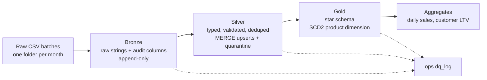
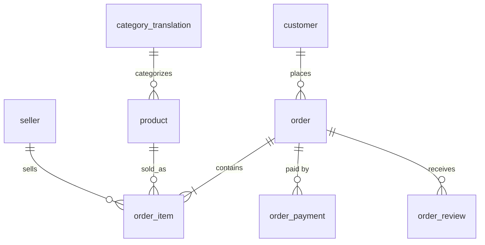
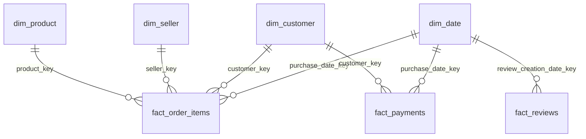

# Medallion Data Model (PySpark + Delta Lake)

Dataset: [Olist Brazilian E-Commerce](https://www.kaggle.com/datasets/olistbr/brazilian-ecommerce) (Kaggle, 9 CSV files, ~100k orders, 2016-09 to 2018-10).

## 1. Source tables and known quirks

| File | Grain | Key |
|---|---|---|
| `olist_customers_dataset.csv` | one row per **order's** customer record | `customer_id` |
| `olist_orders_dataset.csv` | one row per order | `order_id` |
| `olist_order_items_dataset.csv` | one row per item in an order | `order_id, order_item_id` |
| `olist_order_payments_dataset.csv` | one row per payment of an order | `order_id, payment_sequential` |
| `olist_order_reviews_dataset.csv` | one row per review | `review_id, order_id` |
| `olist_products_dataset.csv` | one row per product | `product_id` |
| `olist_sellers_dataset.csv` | one row per seller | `seller_id` |
| `olist_geolocation_dataset.csv` | many rows per zip prefix | none (needs collapsing) |
| `product_category_name_translation.csv` | Portuguese to English category | `product_category_name` |

Quirks that drive modeling decisions:

- **`customer_id` is per order.** The real person is `customer_unique_id`. The Gold customer dimension is keyed on the unique id.
- **`review_id` is not unique** across orders, so the key is `(review_id, order_id)`.
- **Geolocation has many rows per zip prefix** and some coordinates fall outside Brazil. Filter outliers, then average per prefix.
- **Misspelled columns:** `product_name_lenght`, `product_description_lenght`. Renamed in Silver.
- **Missing translations:** a couple of categories are absent from the translation file, and some products have no category. Fallback: English, then Portuguese, then `unknown`.
- **Payments fan out.** An order can have several payment rows, so payments are their own fact table and are never joined directly to items.
- **Delivery timestamps are null** for orders that were not delivered.
- The translation CSV may start with a **BOM**, which corrupts the first column name. Bronze cleans column names.

## 2. Architecture



Because Olist is a static dump, `Scripts/Simulate-BatchFile_new.py` splits it into **monthly batches** (by order purchase month) so you can practice incremental loads. It uses Python's standard library to process CSVs without pandas, and injects a **product change batch** (category and weight changes) to exercise SCD Type 2.

## 3. Bronze (`bronze.*`)

One table per source file, named after the entity: `customers`, `geolocation`, `orders`, `order_items`, `order_payments`, `order_reviews`, `products`, `sellers`, `category_translation`.

- All columns stay **strings** (schema-on-read). Nothing is rejected at this layer.
- Audit columns: `_ingest_ts`, `_source_file`, `_batch_id`.
- Append-only. Re-running a batch deletes that `_batch_id` first and re-appends, so loads are **idempotent**.
- At real scale you would partition by ingestion date. At 100k rows, partitioning only creates tiny files, so it is left unpartitioned here.

## 4. Silver (`silver.*`)

Typed, validated, one row per business key, loaded with Delta `MERGE`.

| Table | Primary key | Main transformations |
|---|---|---|
| `customer` | `customer_id` | zip padded to 5 digits, city title-cased, state upper-cased |
| `order` | `order_id` | status lower-cased, 5 timestamp columns cast |
| `order_item` | `order_id, order_item_id` | `price`, `freight_value` as `DECIMAL(12,2)`, must be >= 0 |
| `order_payment` | `order_id, payment_sequential` | `payment_value` as `DECIMAL(12,2)`, installments as int |
| `order_review` | `review_id, order_id` | score must be 1 to 5, timestamps cast |
| `product` | `product_id` | typo columns renamed, English category joined (with fallback) |
| `seller` | `seller_id` | same cleanup as customer |
| `geolocation` | `zip_prefix` | outliers removed, averaged to one row per prefix |
| `category_translation` | `category_pt` | BOM cleaned |

Data quality:

- Each table has a validity rule (null keys, negative amounts, invalid scores). Failing rows go to `silver.quarantine_<table>` with the failed rule.
- `ops.dq_log` records rows in, rows out, and rows quarantined per table, layer, and batch.
- Within a batch, duplicates are collapsed to the latest `_ingest_ts` before the MERGE.



## 5. Gold (`gold.*`): star schema

**Surrogate keys** are deterministic hashes (`xxhash64`) of the business key. For the SCD2 product dimension the hash also includes `effective_from`, so each version has its own key. This avoids a central sequence generator and makes reloads reproducible.

| Table | Type | Grain | Notes |
|---|---|---|---|
| `dim_date` | dimension | one row per day | `date_key` as `yyyyMMdd` int, calendar attributes |
| `dim_customer` | dimension (SCD1) | one row per `customer_unique_id` | location from the customer's latest order, lat/lng from geolocation |
| `dim_seller` | dimension (SCD1) | one row per seller | location plus lat/lng |
| `dim_product` | dimension (**SCD2**) | one row per product **version** | tracks category and physical dimensions; `effective_from`, `effective_to`, `is_current` |
| `fact_order_items` | fact | one row per order item | prices, freight, delivery days, delay days, `is_late`; points to the product version valid at purchase time |
| `fact_payments` | fact | one row per payment | type, installments, value |
| `fact_reviews` | fact | one row per review | score, response hours, has_comment |
| `agg_daily_sales` | aggregate | one row per purchase date | orders, items, GMV, freight, avg delivery days, late rate |
| `agg_customer_ltv` | aggregate | one row per customer | orders, items, total spent, first and last purchase |



`order_id` is kept on all facts as a **degenerate dimension**, so payments and reviews can be related back to items without fanning out.

### SCD2 mechanics (`dim_product`)

1. Hash the tracked columns (category, weight, length, height, width) into `_hash`.
2. Compare against the current version of each product.
3. New product: insert a row. Changed product: close the current row (`effective_to` = new `effective_from`, `is_current = false`) and insert a new row. This is one Delta `MERGE` using the "staged union" pattern.
4. The first load uses `effective_from = 1900-01-01`, so all historical orders attach to version 1. Later changes start at the batch's first day.
5. The fact load joins `purchase_ts` into the `[effective_from, effective_to)` window, which is how an order lands on the correct product version.

### Gaps left on purpose (good extensions)

- **Unknown members:** missing product matches currently get `product_key = -1`, but no `-1` row exists in `dim_product`. Add one.
- **Aggregates are fully rebuilt** each batch. At scale, make them incremental.
- **Soft checks** (for example delivery date earlier than purchase date) are not enforced. Add them as warnings in `ops.dq_log`.
- **Quarantine rows are typed**, not raw. Keep the raw record if you need to replay.

## 6. How to run

Requirements: Java 11 or 17, Python 3.9+.

```bash
pip install "pyspark==3.5.*" "delta-spark==3.2.*"

# 1. Download the 9 Olist CSVs from Kaggle into data/raw/
# 2. Split them into monthly batches (and inject a product change in 2018-01)
python Scripts/Simulate-BatchFile_new.py --raw data/raw --out data/batches

# 3. Run bronze -> silver -> gold for every batch, in order
python olist_pipeline.py --batches-dir data/batches
```

Tables are created under `./lake` (Delta) with a local metastore.

Sanity queries (run in `pyspark` or a notebook with the same Delta config):

```sql
-- SCD2 products with more than one version
SELECT product_id, category_en, weight_g, effective_from, effective_to, is_current
FROM gold.dim_product
WHERE product_id IN (SELECT product_id FROM gold.dim_product GROUP BY 1 HAVING COUNT(*) > 1)
ORDER BY product_id, effective_from LIMIT 20;

-- Pipeline health per batch
SELECT batch_id, layer, tbl, rows_in, rows_out, rows_quarantined
FROM ops.dq_log ORDER BY logged_at;

-- Revenue per product category (uses the version valid at purchase time)
SELECT p.category_en, ROUND(SUM(f.price), 2) AS revenue
FROM gold.fact_order_items f JOIN gold.dim_product p USING (product_key)
GROUP BY 1 ORDER BY revenue DESC LIMIT 10;
```